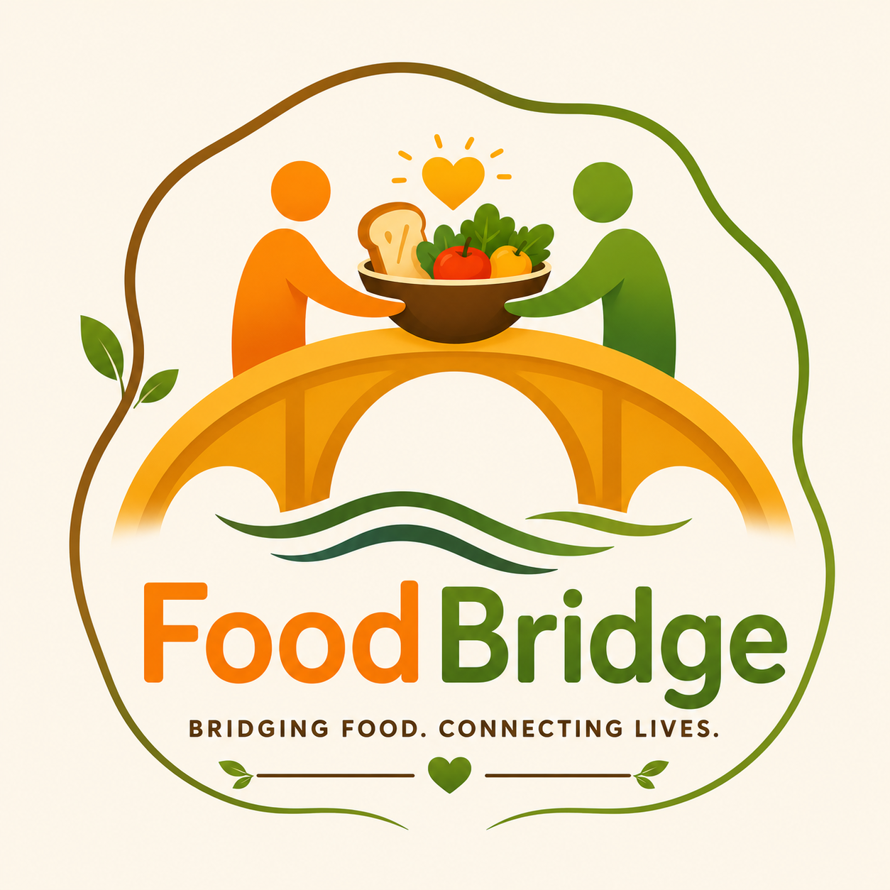

<p align="center">
  
</p>

<h1 align="center">🍽️ FoodBridge</h1>

<p align="center">
  <strong>Connecting surplus food with those who need it, one donation at a time.</strong>
</p>

<p align="center">
  Reduce Food Waste • Support Communities • Share with Purpose
</p>

<p align="center">
  <a href="https://food-bridge-self.vercel.app/"><strong>🌐Live Demo</strong></a>
  •
  <a href="#-features"><strong>Features</strong></a>
  •
  <a href="#-tech-stack"><strong>Tech Stack</strong></a>
  •
  <a href="#-running-the-project-locally"><strong>Getting Started</strong></a>
</p>
FoodBridge is a full-stack web application that helps reduce food waste by connecting food donors with nearby receivers such as NGOs, charities, shelters, and community organizations. Instead of letting surplus food go to waste, FoodBridge makes it easy to share it with people who can put it to good use.
<br><br>
Built with a focus on simplicity, location-based discovery, and real-time request management, the platform streamlines the entire donation process i.e. from posting available food to successful collection.

## Why FoodBridge?

Every day, large quantities of perfectly edible food are wasted while many people continue to struggle with food insecurity.

FoodBridge aims to bridge this gap by providing a platform where:

-  Individuals and organizations can donate surplus food.
-  Nearby receivers are notified about available donations.
-  Donors and receivers can coordinate food collection efficiently.
-  Communities can work together to reduce food waste.

## Features

<table>
  <tr>
    <td width="25%" valign="top">

### 👨‍🍳 For Donors

- Create food donation listings.
- Manage active and previous donations.
- View donation status in real time.
- Accept one receiver request while automatically rejecting remaining requests.
- Edit or cancel donations before collection.
- Dashboard with donation statistics and recent activity.

  </td>

  <td width="25%" valign="top">

### 🤝 For Receivers

- Discover nearby food donations based on current location.
- Request available food with a single click.
- Track request status.
- View accepted and completed requests.
- Mark donations as collected after pickup.

  </td>

  <td width="25%" valign="top">

### 🔔 Notifications

- Nearby receivers receive instant notifications.
- Location-based donation alerts.
- Donors receive request updates.
- Complete donation lifecycle notifications.

  </td>

  <td width="25%" valign="top">

### 📊 Dashboard

- Donation statistics.
- Request tracking.
- Collection history.
- Recent activity overview.

  </td>
  </tr>
</table>

## Tech Stack

<table width="100%">
<tr>
<td width="20%" align="center"><b> Frontend</b></td>
<td width="80%">


</td>
</tr>

<tr>
<td align="center"><b> Backend</b></td>
<td>


</td>
</tr>

<tr>
<td align="center"><b> Database</b></td>
<td>


</td>
</tr>

<tr>
<td align="center"><b> Deployment</b></td>
<td>


</td>
</tr>
</table>

## How It Works
1. A donor posts details about surplus food.
2. Nearby receivers are notified based on their current location.
3. Interested receivers send requests.
4. The donor accepts one request.
5. Remaining pending requests are automatically rejected.
6. The receiver collects the food and marks it as collected.
7. The donation is successfully completed.

## ⚠️ Heads Up

### Best Viewed on Desktop

FoodBridge is currently optimized for desktop and laptop browsers. While it works on mobile devices, the interface is not yet fully responsive and may not provide the best experience.

### Location Access for Receivers

Receivers are required to enable location access to discover nearby food donations. Your location is used only for location-based donation matching.

## Running the Project Locally
### Clone the repository
- git clone https://github.com/<your-username>/FoodBridge.git
- cd FoodBridge
### Backend
- cd server
- npm install
- npm start
### Frontend
- cd client
- npm install
- npm run dev

## Project Structure

```graphql
FoodBridge/
│
├── client/
│   ├── src/
│   ├── public/
│   └── ...
│
├── server/
│   ├── config/
│   ├── controllers/
│   ├── middleware/
│   ├── models/
│   ├── routes/
│   ├── services/
│   ├── utils/
│   ├── validators/
│   └── ...
│
└── README.md
```
## Future Improvements
1. Fully responsive mobile interface.
2. Email notifications.
3. Interactive map view for donations.
4. Ratings and feedback system.
5. Image upload for donations.
6. Enhanced authentication and verification.
7. Admin dashboard and analytics.

## ❤️ Impact
FoodBridge is more than just a web application.

It demonstrates how technology can reduce food waste, encourage community participation, and make surplus food accessible to those who need it most. Every successful donation represents one less meal wasted and one more meal shared.

## Screenshots & Demo

Explore FoodBridge through the resources below:

- **Project Screenshots:** Browse all application screenshots in the [`assets/screenshots`](./assets/screenshots) directory.
- **YouTube Walkthrough:** Watch the complete project demonstration [here](https://youtu.be/rPR_xzJc1WY).

> 💡 For the best experience, explore the **🌐 Live Demo** to interact with the application in real time.
